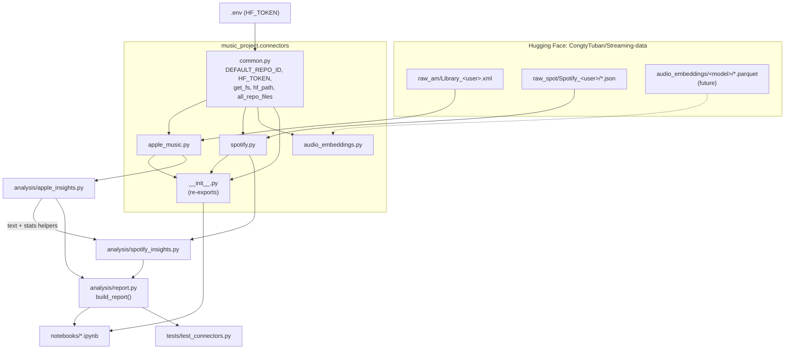
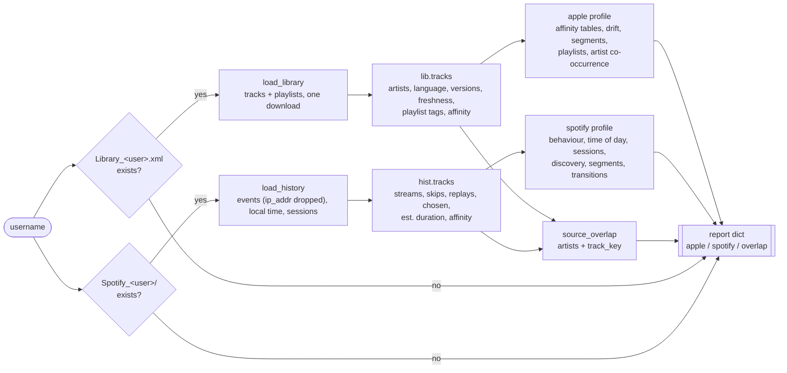
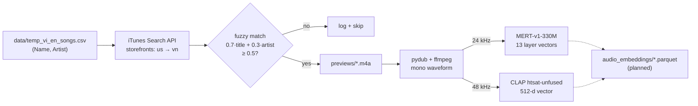

# Project Structure

Current layout of `Music-Project` (branch `basic_build`). Data comes from the Hugging Face dataset
`CongtyTuban/Streaming-data`; nothing large is committed to git.

## Directory tree

```
Music-Project/
├── pyproject.toml            # deps + uv config (torch CPU on macOS, CUDA 12.1 on Windows)
├── uv.lock                   # pinned versions, do not edit by hand
├── .python-version
├── README.md                 # setup guide (uv)
│
├── src/music_project/
│   ├── __init__.py
│   ├── connectors/           # read raw data from the HF dataset repo
│   │   ├── __init__.py       # re-exports the public connector API
│   │   ├── common.py         # repo id, HF_TOKEN, hf:// path + file helpers
│   │   ├── apple_music.py    # raw_am/Library_<user>.xml  -> DataFrame
│   │   ├── spotify.py        # raw_spot/Spotify_<user>/*.json -> DataFrame
│   │   ├── itunes_preview.py # iTunes Search API -> 30s .m4a preview clips
│   │   └── audio_embeddings.py  # Parquet embeddings (scaffold, not exported yet)
│   └── analysis/
│       ├── apple_insights.py # Apple XML -> recsys track features + taste profile / CLI
│       ├── spotify_insights.py # Spotify history -> per-play events, track features, profile / CLI
│       └── report.py         # both profiles + cross-source overlap, build_report()
│
├── scripts/
│   └── am_previews_fetch.py  # CSV of songs -> 30s .m4a previews via iTunes Search API
│
├── notebooks/                # exploration only
│   ├── parse.ipynb           # early AM/Spotify parsing (logic now in connectors/)
│   ├── streamdata.ipynb      # early HF dataset streaming test
│   ├── sampleAnalytics.ipynb # build_report() usage
│   └── sampleFetch.ipynb     # iTunes search + loading all users' data
│
├── tests/
│   ├── test_connectors.py    # smoke script: build_report("kha")
│   ├── test_apple_insights.py # offline asserts on a synthetic library
│   ├── test_spotify_insights.py # offline asserts on a synthetic history
│   └── apple_fetch.py        # preview -> waveform -> MERT / CLAP embedding experiments
│
└── data/                     # local cache, gitignored (except .gitkeep)
    ├── raw_am/Library_<user>.xml
    ├── raw_spot/Spotify_<user>/
    └── temp_vi_en_songs.csv  # input for am_previews_fetch.py
```

## Module dependencies



## Data flow: `build_report(username)`



A missing source comes back as `None`; overlap is only computed when both exist.

## Audio preview / embedding pipeline (experimental)



`scripts/am_previews_fetch.py` covers CSV → `.m4a`. Waveform and embedding steps live only in
`tests/apple_fetch.py` for now.

## Known loose ends

- `analysis/` has no `__init__.py`. Imports still work because it's a namespace package.
- `audio_embeddings.py` docstring says `embeddings/`, but `EMBEDDINGS_DIR` in `common.py` is `audio_embeddings`.
- `tests/` has no real pytest tests. Both files are scripts that make network calls.
- The scripts import `requests`, but it's only installed because another package depends on it. It isn't declared in `pyproject.toml`.
- README §6 still shows the old planned layout (`ingest/`, `db/`, `rag/`…).
